# Campaign Forge

**Dungeon Master's Companion — en Kivy-basert Android-app for D&D 5e**

Campaign Forge er en tabletop-RPG-companion bygd for Dungeons & Dragons 5e (2024-reglene). Appen samler alt en DM trenger under spilløkta: bildebibliotek, stemningslyder, karakterark, initiativ-tracker og battlemap — alt i et varmt, pergament-inspirert grensesnitt. Telefonen kan caste bilder og kart til en TV via Chromecast slik at spillerne ser det du vil de skal se.

Tema: **Emerald Grove** — mosegrønt, pergament og varmt gull.
Versjon: **0.1** · Språk: Norsk · System: D&D 5e (2024)

---

## Innhold

- [Funksjoner](#funksjoner)
- [Skjermbilder](#skjermbilder)
- [Kom i gang](#kom-i-gang)
- [Mappestruktur på enheten](#mappestruktur-på-enheten)
- [Bygging](#bygging)
- [Teknisk arkitektur](#teknisk-arkitektur)
- [Konfigurasjon](#konfigurasjon)
- [Feilsøking](#feilsøking)
- [Veikart](#veikart)

---

## Funksjoner

Appen er delt i fem hovedfaner. Karakter-fanen har sub-faner for å holde komplekse funksjoner organisert:

### 🖼️ Bilder
- Galleri med mappenavigering for å organisere bilder per kampanje eller sesjon
- Stor preview-ramme i gull — fade-inn-animasjon mellom bildebytter
- Tapp et bilde for å vise det; valgfritt auto-cast til TV samtidig
- Gjenkjenner `.png`, `.jpg`, `.jpeg`, `.webp`

### 🔊 Lyd
Kombinert fane med sub-fanene **Musikk** og **Ambient**:

**Musikk** — lokal avspilling
- Leser `.mp3`, `.ogg`, `.wav`, `.flac` fra `music/`-mappen
- Persistent mini-player nederst (Play/Pause/Neste/Forrige) som ikke forsvinner når du bytter fane
- Bruker Android MediaPlayer via `pyjnius` for stabil bakgrunnsavspilling

**Ambient** — stemningslyder strømmet fra Internet Archive
- Syv kategorier tilpasset D&D-sjangeren: Natur · Kro og by · Dungeon og hule · Leir og bål · Skog og villmark · Kamp · Horror
- Omtrent 35 kuraterte spor dekker alt fra en fredelig taverna til en tordenstorm over slagmarken
- Separat volumkontroll fra musikken, så du kan mikse kro-snakk under en oppdragsintroduksjon
- Ingen opplasting nødvendig — lenkene peker rett på public-domain-spor

### 🎭 Karakter
Sub-faner for karakterarbeid og kamp-støtte:

**Karakterer** — D&D 5e 2024-karakterark
- Full CRUD: opprett, rediger og slett karakterer
- Alle seks evner med automatisk modifier-beregning
- Ferdigheter med proficiency-toggles
- HP, AC, initiativ-bonus, conditions, spell slots og trollformler
- PC og NPC skilles visuelt med ulik fargekoding
- Lagres i `characters.json` på enheten

**Initiativ** — kamp-tracker
- Legg til PCer/NPCer fra karakter-lista, eller ad hoc-fiender
- Skriv inn initiativ-kast, sorter automatisk
- Bla gjennom runder og turer med aktiv-deltaker-indikator
- HP-oppdatering direkte fra trackeren

**Kart** — battlemap-komposisjon
- Komponér battlemap fra bakgrunnsbilde + token-overlegg
- 16:9 canvas (1280×720) optimalisert for TV-casting
- 5 ft per rute (D&D 5e-standard)
- Bruker Pillow (PIL) for bildebehandling — deaktiveres gracefully hvis PIL ikke er tilgjengelig
- Lagrer konfigurasjon i `battlemap.json` og genererer `battlemap_current.png`

### 📖 Regler
- Sammenleggbar mappestruktur med D&D 5e-referanser
- Overlay-visning for regel-innhold — ingen nettilgang nødvendig
- Raskt oppslag midt i spilløkta

### 📺 Cast
- Oppdager Chromecast-enheter på lokalnett via mDNS
- Caster bilder og battlemaps direkte til TV
- Lokal HTTP-server (port 8089) serverer media til Chromecast
- Auto-cast: bilder caster automatisk når de vises hvis en enhet er tilkoblet

---

## Skjermbilder

<table>
  <tr>
    <td align="center"><details><summary>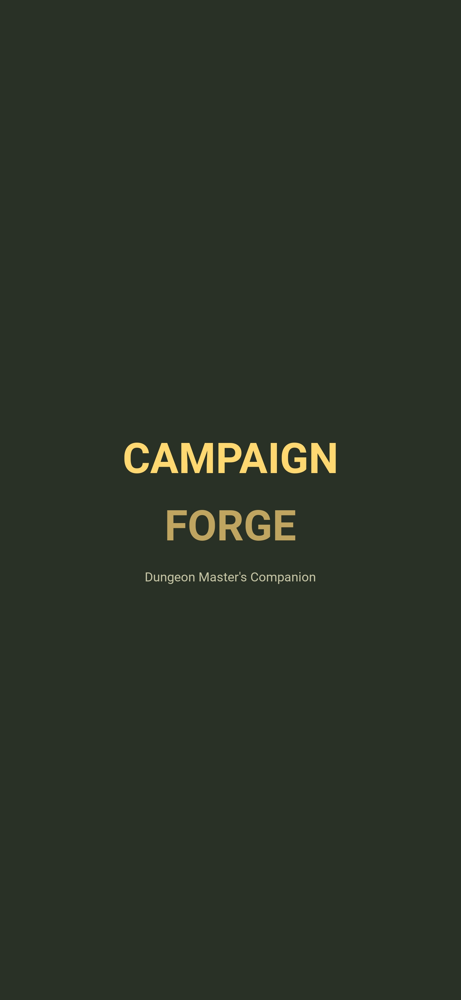</summary></details></td>
    <td align="center"><details><summary></summary></details></td>
    <td align="center"><details><summary>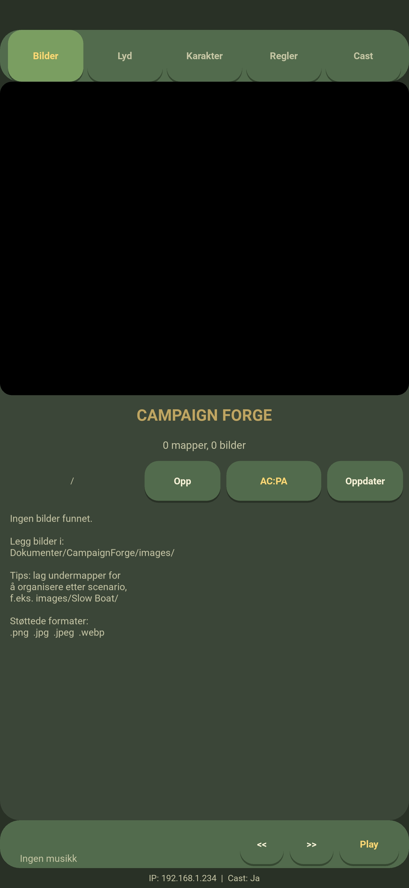</summary></details></td>
    <td align="center"><details><summary>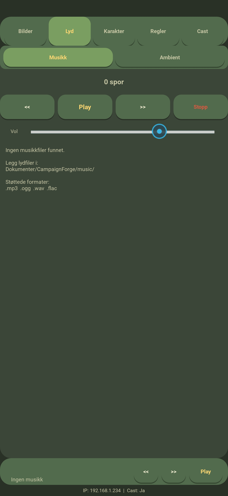</summary></details></td>
    <td align="center"><details><summary>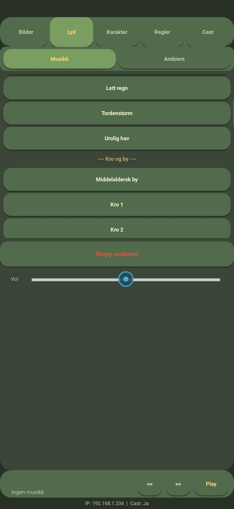</summary></details></td>
  </tr>
  <tr>
    <td align="center"><details><summary>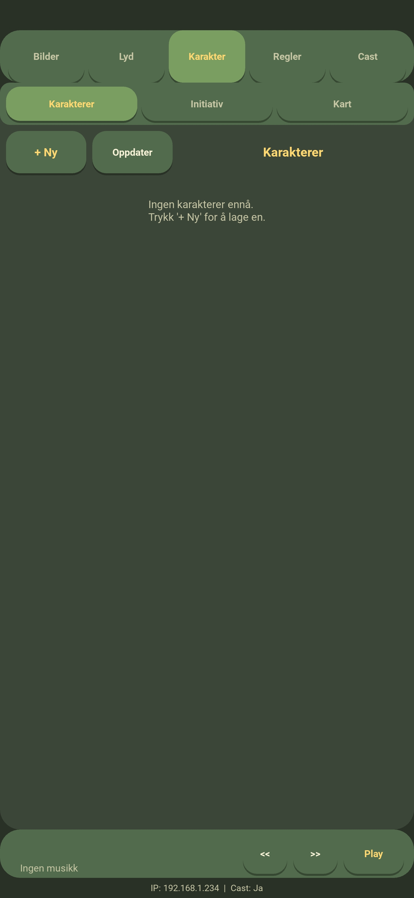</summary></details></td>
    <td align="center"><details><summary>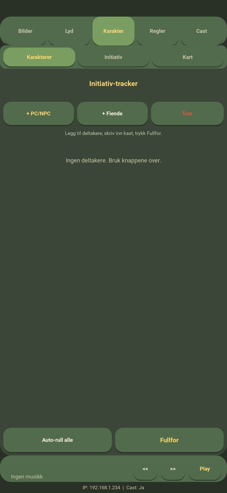</summary></details></td>
    <td align="center"><details><summary>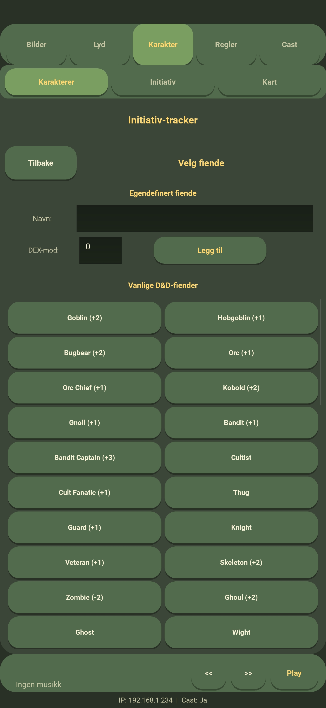</summary></details></td>
    <td align="center"><details><summary>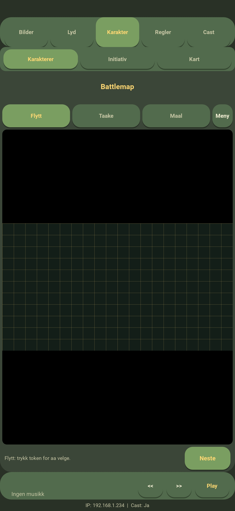</summary></details></td>
  </tr>
  <tr>
    <td align="center"><details><summary>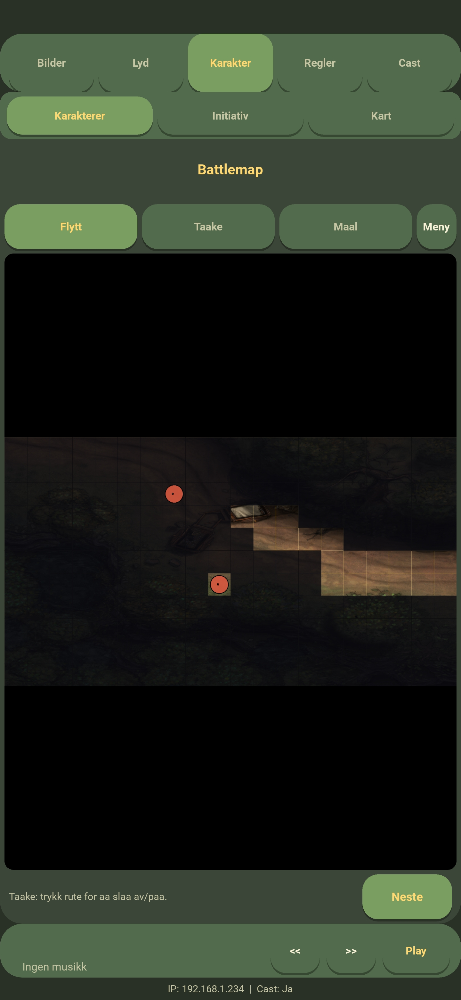</summary></details></td>
    <td align="center"><details><summary>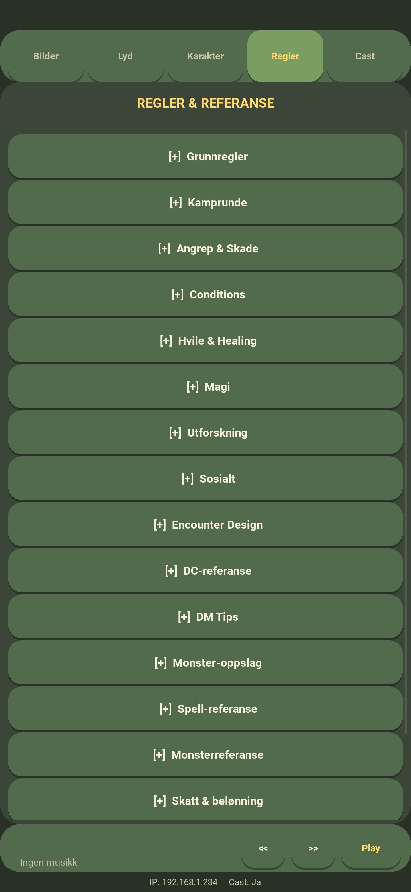</summary></details></td>
    <td align="center"><details><summary>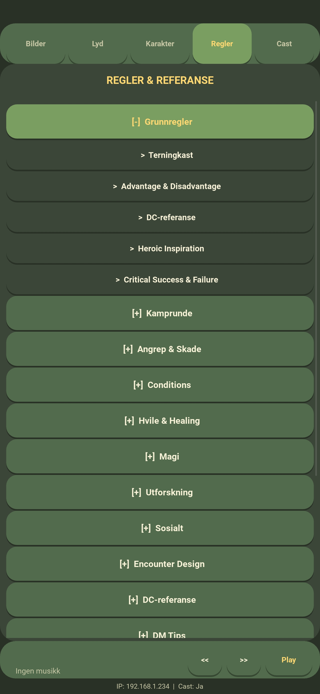</summary></details></td>
    <td align="center"><details><summary>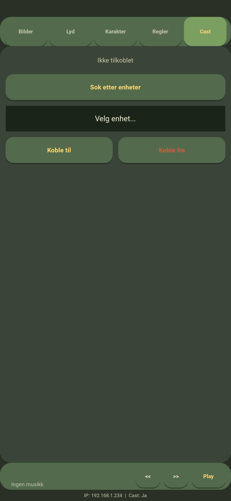</summary></details></td>
  </tr>
</table>

---

## Kom i gang

### Installasjon på enhet

1. Last ned siste `CampaignForge.apk` fra [Releases](https://github.com/gizmo6663-dev/CampaignForge/releases) eller fra GitHub Actions-artefakter
2. Tillat installering fra ukjente kilder i Android-innstillinger
3. Installer APK-en og start appen
4. Gi tillatelser til lagring og nettverk når du blir spurt
5. Restart appen så mappene faktisk opprettes

### Første oppstart

Ved første oppstart oppretter appen denne mappestrukturen automatisk:

```
Dokumenter/CampaignForge/
├── images/          ← bildebibliotek (undermapper støttes)
├── music/           ← lokale musikkspor
├── maps/            ← bakgrunnsbilder for battlemaps
├── characters.json  ← opprettes når du lager første karakter
└── battlemap.json   ← opprettes når du bygger første kart
```

---

## Mappestruktur på enheten

Alle brukerdata ligger i `/sdcard/Documents/CampaignForge/`:

| Sti | Innhold |
|---|---|
| `images/` | Bildegalleri (undermapper støttes) |
| `music/` | Lokale musikkspor |
| `maps/` | Bakgrunnsbilder for battlemaps |
| `characters.json` | Karakterer og NPCer |
| `battlemap.json` | Aktiv battlemap-konfigurasjon |
| `battlemap_current.png` | Generert kompositt for casting |
| `crash.log` | Feillogg for debugging |

---

## Bygging

Campaign Forge bygges som Android APK via GitHub Actions. Workflow-en i `.github/workflows/build-apk.yml` bruker Buildozer inne i en Docker-container (`kivy/buildozer`).

### Bygg via GitHub Actions

1. Push endringer til `main`-branchen — bygging starter automatisk
2. Eller kjør workflow manuelt via **Actions → Build APK → Run workflow**
3. Bruk `clean_build: true`-input hvis du vil tvinge full rebuild (tømmer cache)
4. Last ned APK fra job-artefakter når workflow er ferdig

### Lokal bygging

```bash
pip install buildozer==1.5.0 cython==0.29.36
buildozer -v android debug
# APK havner i bin/
```

---

## Teknisk arkitektur

### Kjerne-klasser

- **`CampaignForgeApp`** — hovedklasse, bygger UI, håndterer faner og state
- **`MediaServer`** — lokal HTTP-server for å serve media til Chromecast
- **`CastMgr`** — innpakning rundt `pychromecast` for enhetsoppdagelse og kontroll
- **`APlayer`** — Android MediaPlayer-wrapper (via `pyjnius`) for musikk
- **`SPlayer`** — streaming-spiller for ambient-lyder
- **`FPlayer`** — fallback-spiller for desktop/testing
- **`RBox`**, **`RBtn`**, **`RToggle`**, **`FramedBox`** — tilpassede widgets med bakgrunn og hjørneradius

### Designregler

- **All tilpasset bakgrunnstegning skjer i `canvas.before`** — aldri i `canvas` eller `canvas.after`. Dette forhindrer at innhold gjemmes bak bakgrunnen og unngår krasj i render-stacken.
- **`markup=True`** er påkrevd på alle labels som bruker `[color]` eller lignende tags.
- **Mini-player er persistent** — den lever utenfor fane-content-området slik at musikken ikke forsvinner når du bytter fane.
- **Sub-fane-state huskes** via `hasattr`-sjekker — du kommer tilbake til samme sub-fane du forlot.

### Avhengigheter

| Pakke | Rolle |
|---|---|
| `kivy` 2.3.0 | UI-rammeverk |
| `pyjnius` | Android MediaPlayer-binding |
| `pychromecast` | Chromecast-oppdagelse og kontroll |
| `zeroconf`, `ifaddr` | mDNS for Chromecast |
| `protobuf` | Chromecast-protokoll |
| `pillow` | Battlemap-komposisjon (valgfri — battlemap-funksjonen deaktiveres gracefully uten) |
| `android` | Android plattform-API |

---

## Konfigurasjon

Viktige linjer i `buildozer.spec`:

```ini
requirements = python3,kivy==2.3.0,pillow,android,pyjnius,pychromecast,zeroconf,ifaddr,protobuf,cython<3.0

android.api = 34
android.minapi = 21
android.ndk = 25b
android.enable_androidx = True

p4a.branch = v2024.01.21
```

**Pinning-notater:**
- `buildozer==1.5.0` — nyere versjoner har inkompatible argumenter med stabil p4a
- `cython==0.29.36` — Cython 3.x bryter med eldre Kivy-versjoner
- `p4a.branch = v2024.01.21` — tag-format med `v`-prefiks og ledende nuller er obligatorisk
- `android.enable_androidx = True` — uten denne prøver Gradle å hente fra jcenter.bintray.com (403)

---

## Feilsøking

### Appen krasjer ved oppstart
Sjekk `/sdcard/Documents/CampaignForge/crash.log`. De vanligste årsakene er manglende tillatelser eller korrupt `characters.json`.

### Musikk spilles ikke
- Bekreft at filene ligger i `music/` og har støttet format (`.mp3`, `.ogg`, `.wav`, `.flac`)
- På noen enheter må appen restartes etter at lagringstillatelse er gitt

### Ambient-lyder laster ikke
- Ambient-lyder strømmes fra Internet Archive — krever nettilgang
- Hvis en spesifikk URL er død, oppdater `AMBIENT_SOUNDS`-lista i `main.py`

### Battlemap-fanen fungerer ikke
- Battlemap krever Pillow — sjekk at `pillow` står i `requirements` i `buildozer.spec`
- Bakgrunnsbilder må ligge i `maps/`-mappen

### Chromecast finner ikke TV
- Telefonen og Chromecast må være på samme Wi-Fi
- HTTP-serveren bruker port 8089 — sjekk at den ikke er blokkert
- Statuslinjen nederst viser lokal IP og cast-tilgjengelighet

### Build-feil: "jcenter.bintray.com 403"
Legg til `android.enable_androidx = True` i `buildozer.spec` og kjør `clean_build`.

### Build-feil: "unknown argument --dir"
Pin til `buildozer==1.5.0` i workflow-filen.

---

## Veikart

Mulige fremtidige funksjoner:

- [ ] Terningkast-verktøy (D&D-terningsett: d4, d6, d8, d10, d12, d20, d100)
- [ ] Nedtellingstimer for sesjonspauser eller rundetidsbegrensning
- [ ] Lydeffekter (one-shot): døråpning, monster-brøl, magi-spell
- [ ] Sesjonsnotater med timestamps
- [ ] Eksport/import av karakterer
- [ ] Custom ambient-URL-liste redigerbar i appen
- [ ] Flere regel-referanser i Regler-fanen
- [ ] Scenario-tracker for pre-skrevne eventyr (inspirert av søster-appen Eldritch Portal)

---

## Testet på

- Samsung Galaxy S25 Ultra · Android 15

## Utvikling

Campaign Forge er et hobbyprosjekt utviklet for aktive D&D 5e-kampanjer. Bidrag og forslag tas imot via issues på GitHub.

**Repository:** [gizmo6663-dev/CampaignForge](https://github.com/gizmo6663-dev/CampaignForge)

**Søster-prosjekter:**
- [EldritchPortal](https://github.com/gizmo6663-dev/EldritchPortal) — Call of Cthulhu / Pulp Cthulhu-variant med Abyssal Purple-tema (norsk)
- [EldritchPortals](https://github.com/gizmo6663-dev/EldritchPortals) — engelsk versjon av EldritchPortal
